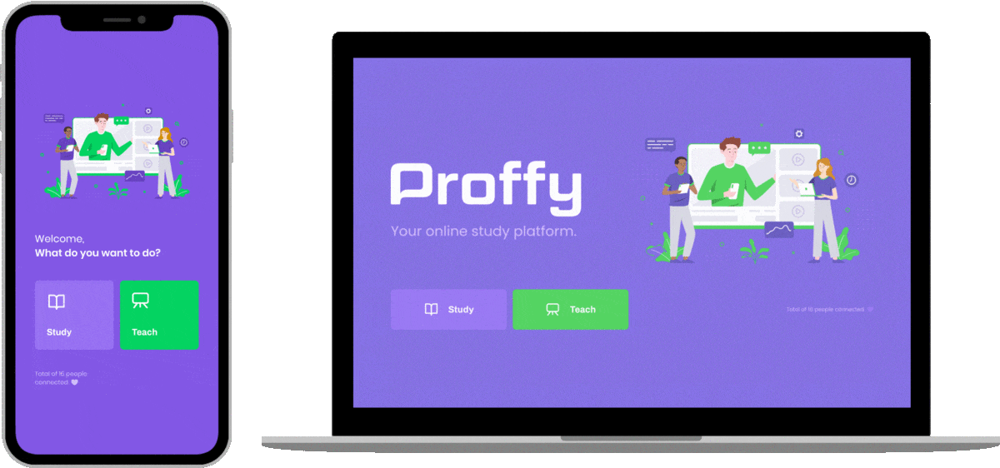

<h1 align="center">
  💜 Proffy
</h1>

<p align="center">
  
</p>

<br />


<p align="center">
  <a href="#-technologies">Technologies</a>&nbsp;&nbsp;&nbsp;|&nbsp;&nbsp;&nbsp;
  <a href="#-about">About</a>&nbsp;&nbsp;&nbsp;|&nbsp;&nbsp;&nbsp;
  <a href="#information_source-how-to-use">How To Use</a>&nbsp;&nbsp;&nbsp;|&nbsp;&nbsp;&nbsp;
  <a href="#-license">License</a>
</p>

<br />

<p align="center">
  
</p>

## 📕 About

Online teaching platform. This project was promoted by [Rocketseat](https://rocketseat.com.br/) and developed during the Next Level Week #2.
<!-- [Click here to see the new version available](). -->

## 🌐 Technologies

This project was developed with the following technologies:


- [TypeScript](https://www.typescriptlang.org)
- [Node.js](https://nodejs.org/en) / [Express](https://expressjs.com)
- [Expo](https://expo.io)
- [React](https://reactjs.org)
- [React Native](https://reactnative.dev/)
- [Knex.js](https://knexjs.org)


## :information_source: How To Use

To clone and run this application, you'll need [Git](https://git-scm.com), [Node.js](https://nodejs.org/en) and [Yarn](https://yarnpkg.com) installed on your computer. From your command line:

```bash
# Clone this repository
$ git clone https://github.com/dominickbrasileiro/proffy

# Go into the repository
$ cd proffy

# Go into the server folder
$ cd server

# Install dependencies
$ yarn install

# Run the server
$ yarn start

# Server is running on port 5000.
```

For the web application and the mobile app, please read the corresponding README.md in each folder.

## 📝 License

This project is under the MIT license. See the [LICENSE](https://github.com/dominickbrasileiro/reactjs-twitter-clone/blob/master/LICENSE) for more information.

---

Made with ❤️ by Dominick Brasileiro 💎 [Get in touch!](https://www.linkedin.com/in/dominickbrasileiro/)

[](https://www.linkedin.com/in/dominickbrasileiro/)
[](mailto:brasileiro.dominick@gmail.com)
